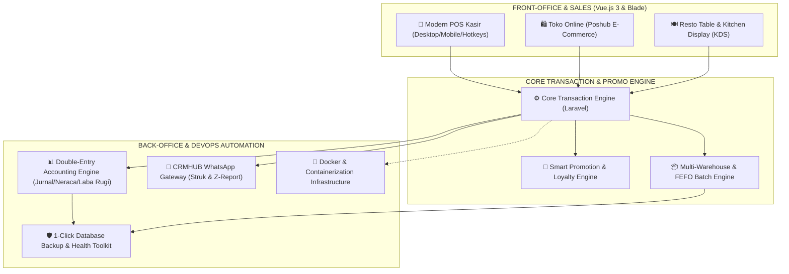

<div align="center">

<!-- PROJECT LOGO & HEADER -->


# 🏬 POSHUB ACCOUNTING
### *Next-Gen Enterprise ERP, Omnichannel POS & Financial Accounting Platform*

[](https://laravel.com)
[](https://vuejs.org)
[](https://developer.mozilla.org)
[](https://php.net)
[](https://mysql.com)
[](https://docker.com)
[](https://poshub.id)
[](https://poshub.id)
[](https://poshub.id)

<p align="center">
  <strong>Solusi Lengkap ERP Terpadu untuk Retail, Grosir, Minimarket, F&B (Resto/Kafe), Apotek, Elektronik, Manufaktur, Jasa, dan E-Commerce.</strong><br>
  Dirancang 100% mandiri (<em>Self-Hosted Standalone</em>) dengan arsitektur modern (<strong>Laravel + Vue.js 3 + Docker Ready</strong>), bebas sewa bulanan, dan mendukung banyak cabang tanpa batasan.
</p>

---

### ⚡ Navigasi Cepat Dokumentasi
[✨ Keunggulan Utama](#-mengapa-memilih-poshub-accounting) • [🛠️ Tech Stack](#-arsitektur-teknologi--stack) • [🏛️ Arsitektur Sistem](#-arsitektur-ekosistem-poshub) • [📦 10 Modul Lengkap](#-ekosistem-10-modul-fitur-enterprise) • [🐳 Docker Quickstart](#-instalasi-instan-menggunakan-docker) • [⚡ Hotkeys Kasir](#-pintasan-keyboard-kasir-pos-hotkeys) • [🚀 Panduan Instalasi Standar](#-panduan-instalasi-standar-tanpa-docker) • [🌐 Panduan Deploy](#-panduan-deployment-server-produksi)

---

</div>

## 🌟 Mengapa Memilih POSHUB ACCOUNTING?

| Fitur / Karakteristik | 🏬 POSHUB Enterprise | ❌ Software POS Tradisional | ❌ Aplikasi Kasir SaaS Biasa |
| :--- | :---: | :---: | :---: |
| **Model Kepemilikan** | **100% Milik Sendiri (Self-Hosted)** | Terkunci di 1 Komputer | Sewa Bulanan/Tahunan |
| **Biaya Berlangganan** | **Rp 0 (Lifetime Unlimited)** | Beli Lisensi Kaku | Terus Membayar Tiap Bulan |
| **Kedaulatan Data** | **Penuh (Tersimpan di Server Anda)** | Rentan Hilang (Lokal) | Disimpan di Server Pihak Ketiga |
| **Batas Jumlah Cabang** | **Tanpa Batas (Unlimited Outlets)** | 1 Cabang Saja | Dikenakan Biaya per Cabang |
| **Frontend Modern** | **Vue.js 3 + SPA Router (Reaktif)** | Monolitik Jadul / Desktop | Template Terkunci |
| **Dukungan Kontainerisasi**| **Docker & Docker-Compose Siap Pakai**| Tidak Ada | Tidak Ada |
| **Modul Akuntansi** | **Otomatis Berpasangan (PSAK)** | Terpisah / Tidak Ada | Terbatas (Hanya Kas Masuk/Keluar) |
| **Otomasi WhatsApp** | **Terintegrasi CRMHUB Gateway** | Tidak Ada | Perlu Berlangganan Eksternal |
| **Mode Antrean Offline** | **Ya (Resilient Sync)** | Hanya Offline | Harus Selalu Terhubung Internet |
| **Dukungan Barcode & FEFO**| **Lengkap (SVG Maker + Expired)** | Terbatas | Tidak Mendukung Batch/IMEI |

---

## 🛠️ Arsitektur Teknologi & Stack

Aplikasi ini dibangun menggunakan tumpukan teknologi (*technology stack*) modern berstandar enterprise:

* **Backend Engine**:
  * **Framework**: Laravel 8.x (PHP 8.0 / PHP 8.1)
  * **ORM & Database**: Eloquent ORM, MySQL 8.0+ / MariaDB 10.6+
  * **Background Queue & Caching**: Redis 7 & Supervisor Process Manager
  * **Security**: Sanctum API Tokens, Role-Based Access Control (Spatie Permission)
* **Frontend Reaktif**:
  * **Framework**: **Vue.js 3** (Composition & Options API)
  * **Routing & State**: **Vue Router 4** (Single Page App) & **Vuex 4**
  * **UI Component Suite**: **PrimeVue 3**, **Bootstrap 5**, SweetAlert2, Chart.js 4
  * **Logic & Networking**: **JavaScript (ES6+)**, Axios HTTP Client, Lodash, Moment.js
  * **Asset Bundler**: Webpack 5 & Laravel Mix 6
* **DevOps & Kontainerisasi**:
  * **Docker Engine** & **Docker Compose (v3.8)**
  * **Web Server**: Nginx Alpine Linux dengan reverse-proxy PHP-FPM
  * **Certbot**: Let's Encrypt SSL/TLS Integration

---

## 🏛️ Arsitektur Ekosistem POSHUB



---

## 📦 Ekosistem 10 Modul Fitur Enterprise

### 1. 🛒 Point of Sale (POS) Omnichannel & Kasir Cepat
* **Antarmuka Kasir Fleksibel**: Dirancang responsif untuk Layar Sentuh (*Touchscreen*), PC Kasir Desktop, Tablet, dan POS Kasir Mobile Smartphone.
* **Pintasan Keyboard (`F1`-`F10`)**: Akselerasi kecepatan kasir pada jam sibuk tanpa bergantung pada mouse.
* **Resiliensi Jaringan (Mode Antrean Offline)**: Transaksi tetap dapat diproses saat internet mati, dan otomatis tersinkronisasi ke server saat jaringan kembali online.
* **Multi-Metode Pembayaran**: Tunai, QRIS Dinamis Otomatis, EDC Kartu Debit/Kredit, Transfer Bank, Saldo Poin Pelanggan, Voucher, dan *Split Bill* (Pisah Tagihan Per Pelanggan).
* **F&B Resto & Kafe Engine**: Manajemen Denah Meja (*Table Layout*), *Kitchen Display System (KDS)* di layar dapur, serta cetak struk pesanan dapur (*Kitchen Order Ticket / KOT*).
* **Customer Display System**: Tampilan layar sekunder yang menghadap ke pelanggan untuk menampilkan total belanja secara real-time.

---

### 2. 📊 Akuntansi & Pembukuan Finansial (*Double-Entry Bookkeeping*)
* **Jurnal Transaksi Otomatis**: Setiap aktivitas penjualan, pembelian, retur, beban operasional, dan mutasi kas secara otomatis membukukan jurnal debit-kredit secara seimbang (*balanced*).
* **Bagan Akun (Chart of Accounts / COA)**: Struktur akun hirarkis standar akuntansi Indonesia (Aktiva Lancar, Aktiva Tetap, Kewajiban, Modal, Pendapatan, HPP, Beban).
* **Laporan Keuangan Komprehensif Real-Time**:
  * 📈 **Laporan Laba Rugi (Income Statement)**: Analisis pendapatan, HPP, laba kotor, beban operasional, dan laba bersih.
  * ⚖️ **Laporan Neraca (Balance Sheet)**: Posisi aset, liabilitas, dan ekuitas perusahaan pada tanggal tertentu.
  * 🌊 **Laporan Arus Kas (Cash Flow Statement)**: Arus kas aktivitas operasi, investasi, dan pendanaan.
  * 📖 **Buku Besar (General Ledger)** & **Neraca Saldo (Trial Balance)**: Jejak mutasi akun terperinci dengan filter tanggal.
* **Rekonsiliasi Bank**: Pencocokan saldo pembukuan internal dengan rekening koran perbankan.
* **Pengelolaan Aset Tetap & Depresiasi**: Perhitungan otomatis biaya penyusutan aset tetap per bulan (*Straight Line Method*).
* **Periode Fiskal & Tutup Buku**: Kunci periode akuntansi untuk mencegah perubahan data historis setelah audit.

---

### 3. 📦 Manajemen Inventori, Gudang & Rantai Pasok (*Supply Chain*)
* **Multi-Cabang & Multi-Gudang**: Pemindahan stok antar-cabang (*Inter-Branch Stock Transfer*) dengan sistem verifikasi kirim, transit, dan terima.
* **Pelacakan Batch & Kedaluwarsa (FEFO)**: Pelacakan nomor batch produksi dan tanggal kadaluarsa (*First Expired, First Out*) untuk apotek, makanan, dan kimia.
* **Pelacakan Serial Number / IMEI**: Manajemen nomor seri unik per unit barang untuk toko HP, laptop, dan barang elektronik bergaransi.
* **Pengadaan Cerdas (1-Click Auto-Draft PO)**: Memindai produk dengan stok di bawah batas aman (*Stock Alert*), menghitung kebutuhan reorder, dan otomatis membuatkan draf *Purchase Order* ke supplier terkait.
* **Stock Opname & Penyesuaian Stok**: Fitur audit fisik berkala dengan pencatatan selisih barang dan jurnal penyesuaian otomatis.

---

### 4. 🏷️ Generator Label Barcode & Rak Produk (*Siap Cetak*)
* **Engine Code-128 & QR Code SVG Murni**: Ringan, tajam, presisi tinggi, dan tanpa dependensi plugin luar.
* **Dukungan Format Kertas Fleksibel**:
  * 🖨️ **Thermal Roll Barcode**: Ukuran 33x15mm (3 kolom), 40x30mm (2 kolom), dan 50x30mm (1 kolom).
  * 📄 **Kertas Label Stiker A4 & Tom & Jerry** (T&J No. 108, T&J No. 121, dll).
* **Informasi Lengkap**: Memuat Nama Toko, Nama Produk, Varian, Barcode Garis, SKU, dan Harga Jual (Rp).

---

### 5. 📱 Integrasi WhatsApp CRMHUB OMNICHANNEL Gateway
* **Struk Digital WhatsApp (Paperless)**: Kirimkan nota resmi transaksi belanja langsung ke nomor WhatsApp pelanggan dalam hitungan detik setelah pembayaran selesai.
* **Laporan Tutup Shift (Z-Report) Otomatis ke HP Owner**: Setiap kali kasir menutup shift kasir, sistem otomatis merangkum omset, kas di laci, non-tunai, pengeluaran, dan selisih kas lalu mengirimkannya langsung ke WhatsApp Owner/Manager.
* **Pengingat Jatuh Tempo Piutang Pelanggan**: Notifikasi otomatis penagihan invoice jatuh tempo ke kontak pelanggan.

---

### 6. 🎁 Program Loyalitas, Member VIP & Mesin Promosi Cerdas
* **Akumulasi Poin Loyalitas**: Belanja otomatis dikonversi menjadi poin (misal: Rp 10.000 = 1 Poin).
* **Tingkatan Membership Dinamis**:
  * 🥉 **Bronze Member** (0% Auto Diskon)
  * 🥈 **Silver Member** (2% Auto Diskon)
  * 🥇 **Gold VIP** (5% Auto Diskon)
  * 💎 **Platinum VIP** (10% Auto Diskon)
* **Penukaran Poin di Kasir**: Poin dapat langsung dipotongkan pada nilai tagihan saat checkout (1 Poin = Rp 100).
* **Mesin Promosi Otomatis**: Diskon ambang batas belanja (*Min Spend*), promo bertingkat (*Wholesale Tiers*), dan diskon varian.

---

### 7. 🛍️ E-Commerce Storefront Terintegrasi (Poshub Ecommerce)
* **Sinkronisasi Katalog Real-Time**: Produk, varian harga, dan sisa stok fisik otomatis sinkron antara toko fisik dan toko online.
* **Kalkulator Ongkir Ekspedisi**: Terkoneksi dengan API RajaOngkir untuk estimasi ongkir otomatis (JNE, J&T, SiCepat, POS Indonesia, Anteraja, TIKI, Wahana).
* **Payment Gateway Midtrans**: Pembayaran online instan via QRIS, Virtual Account Bank (BCA, Mandiri, BNI, BRI), Gopay, ShopeePay, dan Indomaret/Alfamart.

---

### 8. 👥 Manajemen SDM, Komisi & Payroll (HRM)
* **Database Karyawan & Jabatan**: Pengelolaan data karyawan per divisi dan cabang toko.
* **Perhitungan Komisi Penjualan**: Kalkulasi otomatis komisi per transaksi bagi sales / kasir.
* **Presensi & Jam Kerja**: Pencatatan riwayat shift dan absensi kerja.
* **Pembuatan Slip Gaji**: Generate slip gaji karyawan bulanan lengkap dengan tunjangan dan potongan.

---

### 9. 🛡️ Pencadangan Basis Data & Pemeliharaan Sistem
* **1-Click Database Backup GUI**: Snapshot database `.sql` langsung dari antarmuka web, tombol unduh aman ke PC lokal, serta *auto-pruning* cadangan lama (>30 hari).
* **1-Click Maintenance Toolkit**: Pembersihan cache Blade views, route cache, application cache, serta optimasi tabel basis data (`OPTIMIZE TABLE`) untuk mempercepat query laporan besar.
* **Server Health Monitor**: Pemantauan real-time sisa kapasitas harddisk server (GB / %) dan validasi kelengkapan ekstensi PHP.

---

### 10. 🔒 Keamanan Data & Hak Akses Berjenjang (*Role-Based Access Control*)
* **Hak Akses Granular (RBAC)**: Pengaturan izin akses detail per modul untuk peran: *Super Admin, Store Manager, Kasir, Supervisor Gudang, Akuntan, dan Staff*.
* **Audit Trail (Activity Log)**: Pencatatan rekam jejak aktivitas login, perubahan data harga, void transaksi, dan penyesuaian stok.

---

### 11. 🏛️ Tier-1 Enterprise ERP Core (*Accurate, HashMicro, Zahir & Kledo Standard*)
* **💼 Modul Pajak & Kepatuhan e-Faktur DJP**:
  * Generator ekspor data Faktur Pajak Keluaran (FK) & Masukan (FM) format CSV resmi DJP 3.0 / 3.2.
  * Manajemen alokasi otomatis Nomor Seri Faktur Pajak (NSFP) dari DJP.
  * Kalkulator & pembukuan otomatis PPh 21, PPh 23 (2%), dan PPh Final 0.5% (UMKM PP 55/2022).
* **📊 Analitik Keuangan Eksekutif & Prediksi Arus Kas (AI Cash Flow Forecast)**:
  * Dashboard *Financial Health Score* dengan **8 Rasio Finansial** (*Current Ratio, Quick Ratio, Gross Margin, Net Margin, ROE, ROA, Debt-to-Equity*).
  * Laporan Umur Piutang & Hutang (**AR/AP Aging Schedule 0-30, 31-60, 61-90, >90 Hari**) dengan 1-klik tagih WhatsApp CRMHUB.
  * Proyeksi Arus Kas Cerdas 30-90 Hari ke depan (*Cash Flow Forecast*).
* **🏢 Cost Center, Departemen & Akuntansi Proyek**:
  * Laporan Laba Rugi terisolasi per Project / Divisi / Cost Center.
  * Otomasi Jurnal Berulang & Amortisasi Beban Dibayar di Muka (*Prepaid Rent / Insurance*).
* **📦 Multi-Satuan Berjenjang (Multi-Tier UoM) & HPP Manufaktur**:
  * Struktur konversi satuan bertingkat (`1 Dus = 12 Pak = 144 Pcs`) dengan auto-deduct pada unit dasar master produk.
  * Kalkulasi HPP Manufaktur lengkap: Bahan Baku (BOM) + Tenaga Kerja Langsung (DL) + Biaya Overhead Pabrik (FOH).
* **🏦 Rekonsiliasi Bank Otomatis & Kas Kecil (Petty Cash)**:
  * Parser mutasi rekening koran format CSV untuk bank BCA, Mandiri, BNI, BRI, Permata, CIMB.
  * Algoritma *Auto-Match* cerdas mencocokkan mutasi bank dengan transaksi internal.
  * Pengelolaan Kas Kecil dengan sistem Dana Tetap (*Imprest*) atau Dana Berubah (*Fluctuating*).
* **🌐 Portal B2B Mandiri Pelanggan & Supplier (Vendor)**:
  * Portal Pelanggan B2B: Cek sisa limit plafon kredit, unduh invoice/faktur pajak PDF, dan bayar online.
  * Portal Supplier: Akses PO yang disetujui, konfirmasi kesiapan kirim (*e-POD*), dan unggah tagihan vendor.

---

## 🐳 Instalasi Instan Menggunakan Docker

POSHUB ACCOUNTING telah dilengkapi dengan konfigurasi **Docker & Docker Compose** multi-container siap pakai:

```bash
# 1. Clone repositori
git clone https://github.com/username-anda/poshub-accounting.git
cd poshub-accounting

# 2. Siapkan file environment
cp .env.example .env

# 3. Jalankan container (App + Nginx + MySQL 8 + Redis 7 + Queue Worker)
docker-compose up -d --build

# 4. Generate Key & Inisialisasi Database di dalam container
docker-compose exec app php artisan key:generate
docker-compose exec app php artisan storage:link
docker-compose exec app php artisan migrate --seed --force
```

Aplikasi langsung aktif di peramban Anda pada: **`http://localhost:8000`**

---

## ⚡ Pintasan Keyboard Kasir (POS Hotkeys)

Gunakan tombol pintasan keyboard berikut pada layar POS kasir untuk mempercepat transaksi:

```
+---------------------------------------------------------------------------------------+
|                              TABEL HOTKEYS KASIR POS                                  |
+-----------+------------------------------------+--------------------------------------+
| Tombol    | Nama Aksi                          | Deskripsi Fungsi                     |
+-----------+------------------------------------+--------------------------------------+
| [F1]      | Bantuan Hotkeys                    | Menampilkan jendela popup daftar hotkey|
| [F2]      | Cari / Scan Barcode                | Langsung fokus ke kotak pencarian     |
| [F4]      | Tahan Pesanan (Hold Bill)          | Menyimpan keranjang belanja sementara |
| [F7]      | Buka Laci Kasir (Open Drawer)      | Mengirimkan sinyal kick ke cash drawer|
| [F8]      | Bayar Uang Pas (Exact Cash)        | Memasukkan nominal bayar persis total|
| [F9]      | Pisah Tagihan (Split Bill)         | Membagi pesanan ke beberapa bill      |
| [F10]     | Selesaikan Pembayaran (Checkout)   | Membuka jendela pembayaran akhir     |
| [ESC]     | Batal / Tutup Jendela              | Menutup popup aktif atau reset cart   |
+-----------+------------------------------------+--------------------------------------+
```

---

## 💻 Panduan Instalasi Standar (Tanpa Docker)

### 1. Kloning Repositori & Pasang Dependensi
```bash
git clone https://github.com/username-anda/poshub-accounting.git
cd poshub-accounting
composer install --no-dev --optimize-autoloader
```

### 2. Konfigurasi File Lingkungan (`.env`)
```bash
cp .env.example .env
```
Sesuaikan parameter koneksi database Anda di `.env`:
```ini
APP_NAME="POSHUB ACCOUNTING"
APP_ENV=production
APP_DEBUG=false
APP_URL=http://localhost:8000

DB_CONNECTION=mysql
DB_HOST=127.0.0.1
DB_PORT=3306
DB_DATABASE=poshub_accounting
DB_USERNAME=root
DB_PASSWORD=

# LICENSE SERVER GOOGLE SHEETS
LICENSE_SHEET_ID=
ALLOW_ALL_LICENSE=false
```

### 3. Generate Application Key & Symlink Storage
```bash
php artisan key:generate
php artisan storage:link
```

### 4. Jalankan Migrasi & Enterprise Master Seeder
```bash
php artisan migrate --seed
```

### 5. Jalankan Server Pengembangan Lokal
```bash
php artisan serve
```
Buka di browser: **`http://127.0.0.1:8000`**

---

## 🔑 Akun & Kredensial Default Sistem

Setelah menjalankan proses seeding, akun default berikut siap digunakan:

| Peran Pengguna | Email Login | Password Default | Akses Panel |
| :--- | :--- | :--- | :--- |
| **👑 Super Administrator** | `admin@poshub.id` | `123456` | `/administrator` (Dashboard Pusat) |
| **🏪 Store Manager & Kasir** | `admin@poshub.id` | `123456` | `/app` (Panel Operasional Cabang) |

> 🔒 **CATATAN KEAMANAN**: Segera ubah kata sandi default ini pada menu profil pengguna sebelum digunakan pada lingkungan produksi!

---

## 🌐 Panduan Deployment Server Produksi

Tersedia dua panduan komprehensif untuk mempublikasikan POSHUB ke server produksi:

* 📄 **[DEPLOYMENT_GUIDE.md](DEPLOYMENT_GUIDE.md)**: Panduan Markdown teks lengkap untuk konfigurasi terminal Linux VPS (Ubuntu/Nginx), SSL Certbot, Supervisor Worker, dan cPanel Shared Hosting.
* 🌐 **[DEPLOYMENT_GUIDE.html](DEPLOYMENT_GUIDE.html)**: Panduan interaktif visual berdesain modern dengan Tab Switcher dan fitur **1-Click Copy Code** (Dapat dibuka langsung di browser pada `public/deployment_guide.html`).

---

---

## 📱 Ekosistem PWA, Android & iOS Native Mobile Apps

POSHUB ACCOUNTING telah dilengkapi dengan arsitektur **Progressive Web App (PWA) + CapacitorJS Native Mobile** yang siap dipublikasikan ke **Google Play Store (Android)** dan **Apple App Store (iOS)**:

```
+==================================================================================================+
|                        ARSITEKTUR MULTI-PLATFORM POSHUB ENTERPRISE                               |
+---+----------------------------+-----------------------------------------------------------------+
| # | Platform                   | Kemampuan & Fitur Utama                                         |
+---+----------------------------+-----------------------------------------------------------------+
| 1 | 🌟 PWA (Web App Standalone)| • 0 Instalasi Toko Aplikasi (Bisa langsung 'Add to Home Screen')|
|   |                            | • Service Worker Cache-First (Buka instan < 1 detik)            |
|   |                            | • Background Auto-Sync saat koneksi internet offline pulih      |
+---+----------------------------+-----------------------------------------------------------------+
| 2 | 🖨️ Direct Bluetooth Print | • Web Bluetooth API (SPP/GATT ESC/POS) langsung ke printer mini |
|   |                            | • Cetak struk kasir 58mm & 80mm instan tanpa pop-up dialog print|
+---+----------------------------+-----------------------------------------------------------------+
| 3 | 📷 Camera Barcode Scanner  | • BarcodeDetector API (EAN-13, Code 128, QR Code) kamera HP     |
+---+----------------------------+-----------------------------------------------------------------+
| 4 | 🤖 Sunmi & iMin POS Driver | • Native JS Bridge untuk mesin kasir Android berprinter built-in|
+---+----------------------------+-----------------------------------------------------------------+
| 5 | 📦 Capacitor Native Apps   | • Android: Rilis Google Play Store (.aab) & Sideload (.apk)     |
|   |                            | • iOS: Rilis Apple App Store (.ipa) & Beta TestFlight           |
+---+----------------------------+-----------------------------------------------------------------+
```

### 🔨 Cara Build Android APK / iOS IPA (Capacitor)
```bash
# 1. Pasang dependensi Capacitor CLI
npm install @capacitor/core @capacitor/cli @capacitor/android @capacitor/ios

# 2. Sinkronkan asset web ke platform native
npx cap sync

# 3. Buka Android Studio untuk Build APK/AAB
npx cap open android

# 4. Buka Xcode (macOS) untuk Build iOS IPA
npx cap open ios
```

---

## 🛠️ Perintah Berguna Pengembang (Cheat-Sheet CLI)

```bash
# Kompilasi frontend Vue.js & asset (Development / Production)
npm run dev
npm run prod

# Bersihkan dan segarkan seluruh cache aplikasi
php artisan config:cache && php artisan route:cache && php artisan view:cache

# Jalankan worker background queue (WhatsApp & Email)
php artisan queue:work database --sleep=3 --tries=3

# Jalankan scheduler tugas berkala
php artisan schedule:run
```

---

## 📄 Hak Cipta & Lisensi

Hak Cipta © 2026 **POSHUB ENTERPRISE**. Semua Hak Dilindungi Undang-Undang.
Dilisensikan untuk penggunaan mandiri internal perusahaan (*Standalone Enterprise Edition*).

