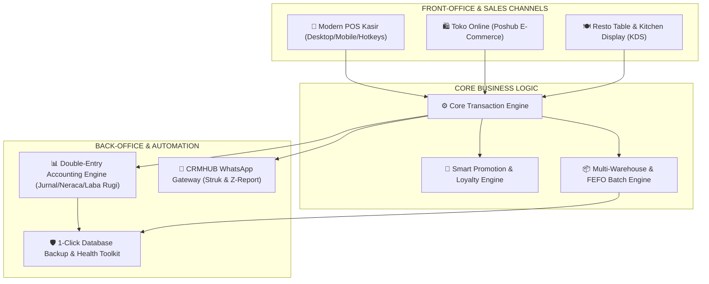

<div align="center">

<!-- PROJECT LOGO & HEADER -->


# 🏬 POSHUB ACCOUNTING
### *The Ultimate All-in-One Enterprise ERP, Omnichannel POS & Financial Accounting Platform*

[](https://laravel.com)
[](https://php.net)
[](https://mysql.com)
[](https://poshub.id)
[](https://poshub.id)
[](https://poshub.id)

<p align="center">
  <strong>Platform Terintegrasi Standar Enterprise untuk Retail, Grosir, Minimarket, F&B (Resto/Kafe), Apotek, Elektronik, Manufaktur, Jasa, dan E-Commerce.</strong><br>
  Dirancang 100% mandiri (<em>Self-Hosted On-Premise / Cloud VPS</em>), bebas biaya sewa bulanan (<em>No SaaS Fees</em>), dan mendukung banyak cabang tanpa batasan (<em>Unlimited Multi-Store</em>).
</p>

---

### ⚡ Navigasi Cepat Dokumentasi
[✨ Keunggulan Utama](#-mengapa-memilih-poshub-accounting) • [🏛️ Arsitektur Sistem](#-arsitektur-ekosistem-poshub) • [📦 Modul & Fitur Lengkap](#-ekosistem-10-modul-fitur-enterprise) • [⚡ Hotkeys Kasir](#-pintasan-keyboard-kasir-pos-hotkeys) • [🚀 Panduan Instalasi](#-panduan-instalasi-cepat-quick-start) • [🌐 Panduan Deploy](#-panduan-deployment-server-produksi)

---

</div>

## 🌟 Mengapa Memilih POSHUB ACCOUNTING?

| Fitur / Karakteristik | 🏬 POSHUB Enterprise | ❌ Software POS Tradisional | ❌ Aplikasi Kasir SaaS Biasa |
| :--- | :---: | :---: | :---: |
| **Model Kepemilikan** | **100% Milik Sendiri (Self-Hosted)** | Terkunci di 1 Komputer | Sewa Bulanan/Tahunan |
| **Biaya Berlangganan** | **Rp 0 (Lifetime Unlimited)** | Beli Lisensi Kaku | Terus Membayar Tiap Bulan |
| **Kedaulatan Data** | **Penuh (Tersimpan di Server Anda)** | Rentan Hilang (Lokal) | Disimpan di Server Pihak Ketiga |
| **Batas Jumlah Cabang** | **Tanpa Batas (Unlimited Outlets)** | 1 Cabang Saja | Dikenakan Biaya per Cabang |
| **Modul Akuntansi** | **Otomatis Berpasangan (PSAK)** | Terpisah / Tidak Ada | Sangat Terbatas (Hanya Kas Masuk/Keluar) |
| **Otomasi WhatsApp** | **Terintegrasi CRMHUB Gateway** | Tidak Ada | Perlu Berlangganan Tambahan |
| **Mode Antrean Offline** | **Ya (Resilient Sync)** | Hanya Offline | Harus Selalu Terhubung Internet |
| **Dukungan Barcode & FEFO**| **Lengkap (SVG Maker + Expired)** | Terbatas | Tidak Mendukung Batch/IMEI |

---

## 🏛️ Arsitektur Ekosistem POSHUB



---

## 📦 Ekosistem 10 Modul Fitur Enterprise

### 1. 🛒 Point of Sale (POS) Omnichannel & Kasir Cepat
* **Antarmuka Kasir Fleksibel**: Dirancang responsif untuk Layar Sentuh (*Touchscreen*), PC Kasir Desktop, Tablet, dan POS Kasir Mobile Smartphone.
* **Pintasan Keyboard (`F1`-`F10`)**: Akselerasi kecepatan kasir pada jam sibuk tanpa bergantung pada mouse.
* **Resiliensi Jaringan (Mode Antrean Offline)**: Transaksi tetap dapat diproses saat internet mati, dan otomatis tersinkronisasi ke server saat jaringan kembali online.
* **Multi-Metode Pembayaran**: Tunai, QRIS Dinamis Otomatis, EDC Kartu Debit/Kredit, Transfer Bank, Saldo Poin Pelanggan, Voucher, dan *Split Bill* (Pisah Tagihan Per Pelanggan).
* **F&B Resto & Kafe Engine**: Manajemen Denah Meja (*Table Layout*), *Kitchen Display System (KDS)* di layar dapur, serta cetak struk pesanan dapur (*Kitchen Order Ticket / KOT*).
* **Customer Display System**: Tampilan layar sekunder yang menghadap ke pelanggan untuk menampilkan total belanja secara real-time.

---

### 2. 📊 Akuntansi & Pembukuan Finansial (*Double-Entry Bookkeeping*)
* **Jurnal Transaksi Otomatis**: Setiap aktivitas penjualan, pembelian, retur, beban operasional, dan mutasi kas secara otomatis membukukan jurnal debit-kredit secara seimbang (*balanced*).
* **Bagan Akun (Chart of Accounts / COA)**: Struktur akun hirarkis standar akuntansi Indonesia (Aktiva Lancar, Aktiva Tetap, Kewajiban, Modal, Pendapatan, HPP, Beban).
* **Laporan Keuangan Komprehensif Real-Time**:
  * 📈 **Laporan Laba Rugi (Income Statement)**: Analisis pendapatan, HPP, laba kotor, beban operasional, dan laba bersih.
  * ⚖️ **Laporan Neraca (Balance Sheet)**: Posisi aset, liabilitas, dan ekuitas perusahaan pada tanggal tertentu.
  * 🌊 **Laporan Arus Kas (Cash Flow Statement)**: Arus kas aktivitas operasi, investasi, dan pendanaan.
  * 📖 **Buku Besar (General Ledger)** & **Neraca Saldo (Trial Balance)**: Jejak mutasi akun terperinci dengan filter tanggal.
* **Rekonsiliasi Bank**: Pencocokan saldo pembukuan internal dengan rekening koran perbankan.
* **Pengelolaan Aset Tetap & Depresiasi**: Perhitungan otomatis biaya penyusutan aset tetap per bulan (*Straight Line Method*).
* **Periode Fiskal & Tutup Buku**: Kunci periode akuntansi untuk mencegah perubahan data historis setelah audit.

---

### 3. 📦 Manajemen Inventori, Gudang & Rantai Pasok (*Supply Chain*)
* **Multi-Cabang & Multi-Gudang**: Pemindahan stok antar-cabang (*Inter-Branch Stock Transfer*) dengan sistem verifikasi kirim, transit, dan terima.
* **Pelacakan Batch & Kedaluwarsa (FEFO)**: Pelacakan nomor batch produksi dan tanggal kadaluarsa (*First Expired, First Out*) untuk apotek, makanan, dan kimia.
* **Pelacakan Serial Number / IMEI**: Manajemen nomor seri unik per unit barang untuk toko HP, laptop, dan barang elektronik bergaransi.
* **Pengadaan Cerdas (1-Click Auto-Draft PO)**: Memindai produk dengan stok di bawah batas aman (*Stock Alert*), menghitung kebutuhan reorder, dan otomatis membuatkan draf *Purchase Order* ke supplier terkait.
* **Stock Opname & Penyesuaian Stok**: Fitur audit fisik berkala dengan pencatatan selisih barang dan jurnal penyesuaian otomatis.

---

### 4. 🏷️ Generator Label Barcode & Rak Produk (*Siap Cetak*)
* **Engine Code-128 & QR Code SVG Murni**: Ringan, tajam, presisi tinggi, dan tanpa dependensi plugin luar.
* **Dukungan Format Kertas Fleksibel**:
  * 🖨️ **Thermal Roll Barcode**: Ukuran 33x15mm (3 kolom), 40x30mm (2 kolom), dan 50x30mm (1 kolom).
  * 📄 **Kertas Label Stiker A4 & Tom & Jerry** (T&J No. 108, T&J No. 121, dll).
* **Informasi Lengkap**: Memuat Nama Toko, Nama Produk, Varian, Barcode Garis, SKU, dan Harga Jual (Rp).

---

### 5. 📱 Integrasi WhatsApp CRMHUB OMNICHANNEL Gateway
* **Struk Digital WhatsApp (Paperless)**: Kirimkan nota resmi transaksi belanja langsung ke nomor WhatsApp pelanggan dalam hitungan detik setelah pembayaran selesai.
* **Laporan Tutup Shift (Z-Report) Otomatis ke HP Owner**: Setiap kali kasir menutup shift kasir, sistem otomatis merangkum omset, kas di laci, non-tunai, pengeluaran, dan selisih kas lalu mengirimkannya langsung ke WhatsApp Owner/Manager.
* **Pengingat Jatuh Tempo Piutang Pelanggan**: Notifikasi otomatis penagihan invoice jatuh tempo ke kontak pelanggan.

---

### 6. 🎁 Program Loyalitas, Member VIP & Mesin Promosi Cerdas
* **Akumulasi Poin Loyalitas**: Belanja otomatis dikonversi menjadi poin (misal: Rp 10.000 = 1 Poin).
* **Tingkatan Membership Dinamis**:
  * 🥉 **Bronze Member** (0% Auto Diskon)
  * 🥈 **Silver Member** (2% Auto Diskon)
  * 🥇 **Gold VIP** (5% Auto Diskon)
  * 💎 **Platinum VIP** (10% Auto Diskon)
* **Penukaran Poin di Kasir**: Poin dapat langsung dipotongkan pada nilai tagihan saat checkout (1 Poin = Rp 100).
* **Mesin Promosi Otomatis**: Diskon ambang batas belanja (*Min Spend*), promo bertingkat (*Wholesale Tiers*), dan diskon varian.

---

### 7. 🛍️ E-Commerce Storefront Terintegrasi (Poshub Ecommerce)
* **Sinkronisasi Katalog Real-Time**: Produk, varian harga, dan sisa stok fisik otomatis sinkron antara toko fisik dan toko online.
* **Kalkulator Ongkir Ekspedisi**: Terkoneksi dengan API RajaOngkir untuk estimasi ongkir otomatis (JNE, J&T, SiCepat, POS Indonesia, Anteraja, TIKI, Wahana).
* **Payment Gateway Midtrans**: Pembayaran online instan via QRIS, Virtual Account Bank (BCA, Mandiri, BNI, BRI), Gopay, ShopeePay, dan Indomaret/Alfamart.

---

### 8. 👥 Manajemen SDM, Komisi & Payroll (HRM)
* **Database Karyawan & Jabatan**: Pengelolaan data karyawan per divisi dan cabang toko.
* **Perhitungan Komisi Penjualan**: Kalkulasi otomatis komisi per transaksi bagi sales / kasir.
* **Presensi & Jam Kerja**: Pencatatan riwayat shift dan absensi kerja.
* **Pembuatan Slip Gaji**: Generate slip gaji karyawan bulanan lengkap dengan tunjangan dan potongan.

---

### 9. 🛡️ Pencadangan Basis Data & Pemeliharaan Sistem
* **1-Click Database Backup GUI**: Snapshot database `.sql` langsung dari antarmuka web, tombol unduh aman ke PC lokal, serta *auto-pruning* cadangan lama (>30 hari).
* **1-Click Maintenance Toolkit**: Pembersihan cache Blade views, route cache, application cache, serta optimasi tabel basis data (`OPTIMIZE TABLE`) untuk mempercepat query laporan besar.
* **Server Health Monitor**: Pemantauan real-time sisa kapasitas harddisk server (GB / %) dan validasi kelengkapan ekstensi PHP.

---

### 10. 🔒 Keamanan Data & Hak Akses Berjenjang (*Role-Based Access Control*)
* **Hak Akses Granular (RBAC)**: Pengaturan izin akses detail per modul untuk peran: *Super Admin, Store Manager, Kasir, Supervisor Gudang, Akuntan, dan Staff*.
* **Audit Trail (Activity Log)**: Pencatatan rekam jejak aktivitas login, perubahan data harga, void transaksi, dan penyesuaian stok.

---

## ⚡ Pintasan Keyboard Kasir (POS Hotkeys)

Gunakan tombol pintasan keyboard berikut pada layar POS kasir untuk melayani pelanggan dengan cepat:

```
+---------------------------------------------------------------------------------------+
|                              TABEL HOTKEYS KASIR POS                                  |
+-----------+------------------------------------+--------------------------------------+
| Tombol    | Nama Aksi                          | Deskripsi Fungsi                     |
+-----------+------------------------------------+--------------------------------------+
| [F1]      | Bantuan Hotkeys                    | Menampilkan jendela popup daftar hotkey|
| [F2]      | Cari / Scan Barcode                | Langsung fokus ke kotak pencarian     |
| [F4]      | Tahan Pesanan (Hold Bill)          | Menyimpan keranjang belanja sementara |
| [F7]      | Buka Laci Kasir (Open Drawer)      | Mengirimkan sinyal kick ke cash drawer|
| [F8]      | Bayar Uang Pas (Exact Cash)        | Memasukkan nominal bayar persis total|
| [F9]      | Pisah Tagihan (Split Bill)         | Membagi pesanan ke beberapa bill      |
| [F10]     | Selesaikan Pembayaran (Checkout)   | Membuka jendela pembayaran akhir     |
| [ESC]     | Batal / Tutup Jendela              | Menutup popup aktif atau reset cart   |
+-----------+------------------------------------+--------------------------------------+
```

---

## 💻 Kebutuhan Sistem & Spesifikasi Server

### Spesifikasi Perangkat Keras:
| Komponen | Lingkungan Minimum | Rekomendasi Enterprise (Produksi) |
| :--- | :--- | :--- |
| **Sistem Operasi** | Ubuntu 20.04 LTS / Windows Server | **Ubuntu 22.04 / 24.04 LTS** |
| **CPU / Processor** | 1 vCPU Core | **2 vCPU Core atau lebih** |
| **RAM / Memori** | 1 GB RAM (dengan Swap 2 GB) | **2 GB - 4 GB RAM** |
| **Storage / Disk** | 10 GB SSD | **30 GB+ NVMe SSD** |
| **Web Server** | Apache 2.4+ / Nginx | **Nginx 1.18+ (PHP-FPM)** |
| **Versi PHP** | PHP 8.0 | **PHP 8.1 (Disarankan)** |
| **Basis Data** | MySQL 5.7+ / MariaDB 10.3+ | **MySQL 8.0+ / MariaDB 10.6+** |

### Ekstensi PHP yang Wajib Aktif:
`bcmath`, `ctype`, `fileinfo`, `json`, `mbstring`, `openssl`, `pdo`, `pdo_mysql`, `tokenizer`, `xml`, `gd`, `curl`, `zip`

---

## 🚀 Panduan Instalasi Cepat (Quick Start)

### 1. Kloning Repositori
```bash
git clone https://github.com/username-anda/poshub-accounting.git
cd poshub-accounting
```

### 2. Pasang Dependensi Composer
```bash
composer install --no-dev --optimize-autoloader
```

### 3. Konfigurasi File Lingkungan (`.env`)
Salin file template `.env.example`:
```bash
cp .env.example .env
```
Buka file `.env` dan sesuaikan parameter database:
```ini
APP_NAME="POSHUB ACCOUNTING"
APP_ENV=production
APP_DEBUG=false
APP_URL=http://localhost:8000

DB_CONNECTION=mysql
DB_HOST=127.0.0.1
DB_PORT=3306
DB_DATABASE=poshub_db
DB_USERNAME=poshub_user
DB_PASSWORD=PasswordDatabaseAnda
```

### 4. Generate Application Key & Symlink Storage
```bash
php artisan key:generate
php artisan storage:link
```

### 5. Jalankan Migrasi & Enterprise Master Seeder
```bash
php artisan migrate --seed
```

### 6. Jalankan Server Aplikasi
```bash
php artisan serve
```
Buka peramban Anda di: **`http://127.0.0.1:8000`**

---

## 🔑 Akun & Kredensial Default Sistem

Setelah menjalankan `php artisan migrate --seed`, akun default berikut siap digunakan:

| Peran Pengguna | Email Login | Password Default | Tujuan URL Panel |
| :--- | :--- | :--- | :--- |
| **👑 Super Administrator** | `admin@poshub.id` | `123456` | `/administrator` (Dashboard Pusat) |
| **🏪 Store Manager & Kasir** | `admin@poshub.id` | `123456` | `/app` (Panel Operasional Cabang) |

> 🔒 **CATATAN KEAMANAN**: Pastikan Anda segera mengubah kata sandi akun default ini di menu *Profil Pengguna* sebelum server digunakan pada lingkungan produksi!

---

## 🌐 Panduan Deployment Server Produksi

Tersedia dua panduan komprehensif untuk mempublikasikan POSHUB ke server produksi:

* 📄 **[DEPLOYMENT_GUIDE.md](DEPLOYMENT_GUIDE.md)**: Panduan Markdown teks lengkap untuk konfigurasi terminal Linux VPS (Ubuntu/Nginx), SSL Certbot, Supervisor Worker, dan cPanel Shared Hosting.
* 🌐 **[DEPLOYMENT_GUIDE.html](DEPLOYMENT_GUIDE.html)**: Panduan interaktif visual berdesain modern dengan Tab Switcher dan fitur **1-Click Copy Code** (Dapat dibuka langsung di browser pada `public/deployment_guide.html`).

---

## 🛠️ Perintah Berguna Pengembang (Cheat-Sheet CLI)

```bash
# Bersihkan dan segarkan seluruh cache aplikasi
php artisan config:cache && php artisan route:cache && php artisan view:cache

# Jalankan worker background job (WhatsApp & Email)
php artisan queue:work database --sleep=3 --tries=3

# Jalankan scheduler berkala
php artisan schedule:run

# Buat snapshot backup database via CLI
php artisan backup:run (atau via Menu Web Pengaturan)
```

---

## 📄 Hak Cipta & Lisensi

Hak Cipta © 2026 **POSHUB ENTERPRISE**. Semua Hak Dilindungi Undang-Undang.
Dilisensikan untuk penggunaan mandiri internal perusahaan (*Standalone Enterprise Edition*).
